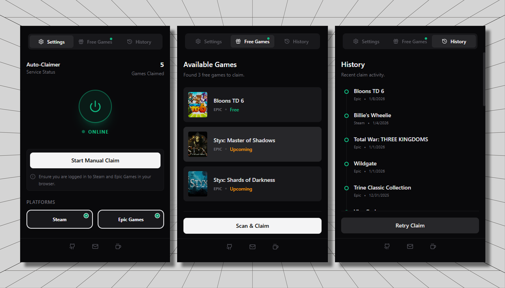

#  Steam & Epic Games Claimer


<br/>
<div align="center">
  
</div>
<br/>

**Never miss a free game again.**  
Automatically claim weekly freebies from the **Epic Games Store** and **Steam** with this powerful, unobtrusive browser extension. Runs silently in the background so you can stay focused.

---

## ✨ Key Features

- **🚀 Automated Claiming:** Automatically checks for and claims free games the first time you launch your browser each day.
- **👻 Silent Background Mode:** Opens game pages in inactive background tabs and automatically closes them after claiming—zero interruptions.
- **📅 Upcoming Games Tracker:** Spot what's coming next week with the "UPCOMING" tag for Epic Games.
- **📜 Smart History Log:** Keeps a clean record of every claimed game, automatically filtering out duplicates.
- **🛡️ Intelligent Filtering:**
  - **Steam:** Automatically skips games already in your library.
  - **Epic:** Checks your history to prevent redundant API calls.
- **⚙️ Fully Customizable:** Toggle platforms (Steam/Epic) on or off via a modern settings UI.
- **🎨 Modern Design:** Built with **React 19** and **Tailwind CSS** for a premium, dark-mode experience.

---

## 🛠️ Installation

### Option 1: Load Build (Recommended)

1.  Download the latest release ZIP file from the [Releases Page](../../releases).
2.  Unzip the file.
3.  **For Chrome/Edge/Brave:**
    - Go to `chrome://extensions`.
    - Enable **Developer Mode** (top right).
    - Click **Load Unpacked**.
    - Select the unzipped folder (specifically the `chrome-mv3` folder if present).
4.  **For Firefox:**
    - Go to `about:debugging`.
    - Click **This Firefox**.
    - Click **Load Temporary Add-on**.
    - Select the `manifest.json` file inside the unzipped folder.

### Option 2: Build from Source

**Prerequisites:** Node.js (v18+) & npm.

1.  **Clone the repository:**

    ```bash
    git clone https://github.com/ssmitpatel/Steam-Epic-Games-Claimer.git
    cd Steam-Epic-Games-Claimer
    ```

2.  **Install dependencies:**

    ```bash
    npm install
    ```

3.  **Build the extension:**

    ```bash
    # Create a production ZIP file
    npm run zip

    # Or for Firefox
    npm run zip:firefox
    ```

    _The output zip file will be located in the `.output/` directory._

4.  **Load into Browser:** Follow the "Load Build" steps above using the generated folder/zip in `.output/`.

---

## 🎮 How to Use

Once installed, the extension works largely on autopilot.

- **Daily Check:** The extension wakes up when you open your browser. If it hasn't checked today, it will silently scan for new games.
- **Manual Control:** Click the extension icon to view the popup.
  - **"Scan & Claim":** Force an immediate check for free games.
  - **Free Games Tab:** View the list of currently available and upcoming games.
  - **History Tab:** See a log of all successful claims.

---

## 🧩 Tech Stack

- **Core:** [WXT](https://wxt.dev/) (Web Extension Tools)
- **UI:** React 19, Tailwind CSS, Lucide React
- **Language:** TypeScript
- **Storage:** WXT Storage (Synced Browser Storage)

---

## ⚠️ Disclaimer

This software is for educational purposes. Use it responsibly. The authors are not responsible for any actions taken by store platforms against accounts using automated tools. This extension is designed to mimic standard user interactions (opening tabs, clicking buttons) to remain safe and unobtrusive.

---

## 🤝 Contributing

Contributions are welcome! Please feel free to submit a Pull Request.

1.  Fork the project
2.  Create your feature branch (`git checkout -b feature/NewFeature`)
3.  Commit your changes (`git commit -m 'Add some NewFeature'`)
4.  Push to the branch (`git push origin feature/NewFeature`)
5.  Open a Pull Request

---

_Created by [Smit](https://github.com/ssmitpatel)_  
_Original concept inspired by spin311_
